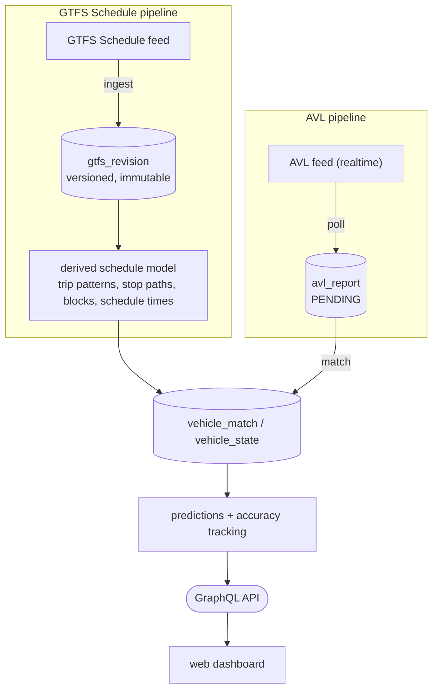

# transittrack

A Kotlin / Spring Boot 4 service that turns published GTFS Schedule + AVL
(Automatic Vehicle Location) feeds into live, predicted vehicle
arrivals/departures — ingested, versioned, matched, and served over GraphQL —
plus a Nuxt dashboard for watching it happen.



## What it does

- **Ingests GTFS Schedule feeds** from remote URLs, storing the full spec in
  Postgres as immutable, queryable **revisions** — every import is kept
  (subject to retention), nothing is overwritten in place.
  → [docs/gtfs.md](docs/gtfs.md)
- **Derives a prediction-ready schedule model** from each revision: trip
  patterns with geometry, stop paths, vehicle blocks (including inference for
  feeds with no `block_id`), and per-trip schedule times.
  → [docs/schedule.md](docs/schedule.md)
- **Ingests AVL feeds** (GTFS-Realtime `VehiclePosition` today) and matches
  each report to a trip in the derived model, spatially and/or against its
  own descriptor, tracking live vehicle state.
  → [docs/avl.md](docs/avl.md)
- **Generates arrival/departure predictions** per stop for every matched
  vehicle, learns travel times (Kalman filter / historical average), and
  tracks prediction accuracy against what actually happened.
  → [docs/predictions.md](docs/predictions.md)
- **Serves all of the above over Spring GraphQL** (GraphiQL at
  `/graphiql`), and ships a **Nuxt/Vue live dashboard** (`web/`) for watching
  matched vehicles and predictions in real time.

## Quickstart (local dev)

```bash
docker compose up -d      # Postgres + Prometheus + Grafana
./gradlew bootRun          # runs everything in one process (monolith mode)
```

GraphiQL: `http://localhost:8080/graphiql`. The shipped `application.yaml`
comes with two example feeds already configured
(`transittrack.feed.feeds`) so there's something to look at immediately.

For the dashboard: see [web/README.md](web/README.md).

## Running tests

```bash
./gradlew test
```

Uses Testcontainers, so a running Docker daemon is required.

## Deployment

Runs as a container, splittable into four independently-scalable
Kubernetes roles (`api` / `ingester` / `feed-processor` / `predictor`)
selected via `SPRING_PROFILES_ACTIVE` — or as one monolith process (the
local-dev default) with no profile set at all. The web dashboard has its
own container too, included in the Helm chart as an opt-in `frontend` role
(`frontend.enabled: false` by default).

→ **[docs/deployment.md](docs/deployment.md)** — image build, roles,
multi-replica coordination (ShedLock), Helm chart usage, scaling guidance.

## Configuration

Every `transittrack.*` setting, its default, and what it controls:

→ **[docs/configuration.md](docs/configuration.md)**

## Extensions

Custom AVL feed decoders, GTFS validators, vehicle matchers, and
prediction strategies load from extra jars on the classpath — no fork, no
rebuild.

→ **[extension-api/README.md](extension-api/README.md)** — the four
extension points and their stability guarantees.
→ **[docs/deployment.md §8](docs/deployment.md#8-extensions)** —
`loader.path`/Helm `extraVolumes` runtime wiring.

## Monitoring

Prometheus (bundled by `docker compose`, UI at
[http://localhost:9090](http://localhost:9090)) scrapes the backend's
`/actuator/prometheus` on port 8080. Grafana is provisioned at
[http://localhost:4000](http://localhost:4000) (local credentials:
`admin` / `admin`) with overview, GTFS import, AVL/matching, and prediction
dashboards. Alert rules currently remain in the Grafana UI; no external
notification channel is configured. See
[docs/deployment.md §5](docs/deployment.md#5-kubernetes--helm) for wiring
metrics up in a cluster instead.

## Documentation index

| Doc | Covers |
| --- | --- |
| [docs/gtfs.md](docs/gtfs.md) | GTFS Schedule ingestion, revisions, mutations, retention, polling |
| [docs/schedule.md](docs/schedule.md) | Derived schedule model: patterns, stop paths, blocks, schedule times |
| [docs/avl.md](docs/avl.md) | AVL ingestion, trip matching, GraphQL read API |
| [docs/predictions.md](docs/predictions.md) | Prediction generation, travel-time learning, accuracy tracking |
| [docs/deployment.md](docs/deployment.md) | Docker image, Kubernetes roles, Helm chart, scaling |
| [docs/configuration.md](docs/configuration.md) | Full `transittrack.*` property reference |
| [docs/benchmarks.md](docs/benchmarks.md) | Ingest/match/predict load benchmarks (kotlinx-benchmark) |
| [docs/ci.md](docs/ci.md) | GitHub Actions: lint, tests, vulnerability scans, benchmarks, image/chart publishing |
| [extension-api/README.md](extension-api/README.md) | Extension points: AVL decoders, GTFS validators, vehicle matchers, prediction strategies |
| [web/README.md](web/README.md) | The Nuxt/Vue vehicle dashboard |
