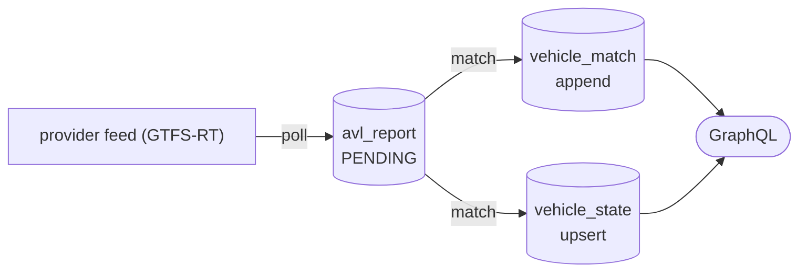

# AVL Ingestion & Trip Matching

This subsystem (`eu.transittrack.avl`) ingests **AVL** (Automatic Vehicle
Location) data from provider real-time feeds, matches each vehicle report to the
derived schedule model of a GTFS feed, and exposes live vehicle state over a
Spring GraphQL read API.

Design reference:
[`docs/superpowers/specs/2026-09-04-avl-ingestion-matching-design.md`](superpowers/specs/2026-09-04-avl-ingestion-matching-design.md).
Schema migrations: `src/main/resources/db/changelog/0002-avl.yaml`.

GTFS-Realtime `VehiclePosition` is the first (and currently only) supported
feed format. Out of scope — see [§8](#8-assumptions--deferred).

---

## 1. Overview



Each `avl_feed` is matched against the **active `gtfs_revision`** of the GTFS feed
it shares a `code` with (`gtfsFeedCode`), and carries an **assignment mode** that
selects the matching strategy:

| Mode | Behaviour |
| --- | --- |
| `TRUST_DESCRIPTOR` | take the feed's `trip_id` descriptor as ground truth; only project the point onto that trip's pattern |
| `DESCRIPTOR_THEN_INFER` | use the descriptor when present and plausible, otherwise fall back to inference |
| `FULL_INFERENCE` | ignore descriptors; score every candidate trip active on the inferred service date and pick the best |

---

## 2. Configuration

Tuning lives under `transittrack.avl`, which is **disabled by default**
(`enabled: false`) — nothing schedules, no beans that touch feeds are created.
Feed *definitions* live in the shared `transittrack.feed.feeds[]` list: a feed
gets an `avl_feed` row when it carries a nested `avl` block (see §3). The
`avl_feed` shares the feed's `code`; its `gtfsFeedCode` link is that same code.

```yaml
transittrack:
  feed:
    prune-config-feeds: false          # delete CONFIG feeds (gtfs_feed + avl_feed) no longer in config
    feeds:                             # see §3
      - code: mbta
        name: "MBTA"
        url: "https://cdn.mbta.com/realtime/gtfs.zip"
        avl:
          url: "https://cdn.mbta.com/realtime/VehiclePositions.pb"
          name: "MBTA VehiclePositions"     # optional; default "<feed name> vehicle positions"
          format: GTFS_RT                    # default GTFS_RT
          poll-interval-sec: 15              # default 15
          assignment-mode: FULL_INFERENCE    # default FULL_INFERENCE
          enabled: true                      # default true
          prediction-algorithm: SCHEDULE_ADHERENCE
          prediction-mode: SINGLE
          headers:                           # optional per-feed request headers
            x-api-key: "…"
  http:                                # shared outbound HTTP client (see docs/gtfs.md §7)
    connect-timeout-ms: 10000
    read-timeout-ms: 60000
    max-size-bytes: 524288000
    user-agent: "transittrack/0.0.1"
  avl:
    enabled: false
    retention:
      report-hours: 24
      match-hours: 72
      stale-vehicle-hours: 12
      sweep-cron: "0 0 * * * *"         # hourly
    match:
      backtrack-tolerance-m: 30.0       # allowed backward jump along the pattern
      max-deviation-m: 60.0             # max point-to-polyline distance for a match
      unmatch-after-failures: 3         # clear the last assignment after N consecutive misses
      trip-end-advance-grace-sec: 120
      candidate-time-slack-sec: 1800    # ± window around a trip's [start,end] for candidacy
      match-interval-ms: 5000           # AvlMatchProcessor fixed delay
      claim-batch-size: 500
      reassign-hysteresis: 0.15         # score margin protecting the incumbent trip
      score-weights:                    # FULL_INFERENCE MatchScorer weights (sum ~1.0)
        deviation: 0.4
        heading: 0.2
        schedule: 0.2
        continuity: 0.2
```

---

## 3. `avl_feed` table + `AvlFeedConfigSynchronizer`

Mirrors `gtfs_feed`. `AvlFeedConfigSynchronizer` is an `ApplicationRunner`
(registered only when `transittrack.avl.enabled = true`) that reconciles the
`transittrack.feed.feeds[]` entries carrying an `avl` block into the `avl_feed`
table at startup, with `source = CONFIG`. The row's `code` and `gtfsFeedCode`
are both the feed's own `code`:

| Situation | Effect |
| --- | --- |
| `code` not in DB | insert |
| existing `CONFIG` feed | update `name`, `url`, `format`, `pollIntervalSec`, `assignmentMode`, `predictionAlgorithm`, `predictionMode`, `enabled`, `headers` |
| existing `API` feed, same `code` | **startup fails** — ambiguous ownership |
| `CONFIG` feed in DB, absent from config (or its `avl` block removed) | left untouched unless `transittrack.feed.prune-config-feeds: true` |

There is currently no GraphQL mutation surface for `avl_feed` (deferred).

---

## 4. Ingest pipeline

`AvlPoller` (only when enabled) owns one `scheduleWithFixedDelay` task per
enabled `avl_feed`, plus a 60s reconciler that diffs the DB against the running
tasks — starting new/enabled feeds, cancelling disabled/removed ones, and
rescheduling a feed whose `pollIntervalSec` changed. Each task body re-reads its
feed row so config edits propagate without a restart.

Each tick calls `AvlIngestService.pollOnce(feed)`:

1. **Fetch** — `AvlFeedSource` (`HttpAvlFeedSource`, okhttp) GETs `feed.url` with
   the feed's configured headers, enforcing the shared `transittrack.http.*`
   timeouts and `max-size-bytes`; non-2xx or oversize throws `AvlFetchException` and is
   recorded in `last_poll_status`.
2. **Decode** — the `AvlFeedDecoder` registered for `feed.format`
   (`GtfsRealtimeVehiclePositionDecoder` for `GTFS_RT`) parses the payload into
   normalized `AvlReport` values.
3. **Dedup** — reports whose `(vehicleId, ts)` already equals the latest stored
   row for that vehicle are dropped.
4. **Append** — survivors are batch-inserted as `avl_report` rows with
   `match_status = PENDING` (via `AvlWriter`, on its own stateless-session
   transaction). `last_poll_at` / `last_poll_status` / `last_poll_report_count`
   are updated on the feed.

No matching happens here.

---

## 5. Match pipeline

`AvlMatchProcessor` (only when enabled) runs on the
`transittrack.avl.match.match-interval-ms` fixed delay; `processBatch()` is
public so tests drive it directly. Per batch:

1. **Claim** up to `claim-batch-size` `PENDING` rows and group by feed.
2. Per feed, open an `AvlMatchContext` — the GTFS feed's **active
   `gtfs_revision`**, `zone`, and cached schedule reads (trips, schedule times,
   service dates, block trips) plus a per-pattern polyline cache. If the GTFS
   feed has no active revision the rows are left `PENDING`.
3. Dispatch each report (oldest-first, so the sequential constraint sees a
   vehicle's history in order) to the `VehicleMatcher` for `feed.assignmentMode`:
   - **`SpatialMatcher`** projects the point onto the trip-pattern polyline,
     enforcing no-backward-jump (`backtrack-tolerance-m`) and block advance, and
     rejecting projections beyond `max-deviation-m`.
   - **`TemporalMatcher`** computes schedule adherence from the stop-path
     cumulative distances and the report's service-seconds.
   - **`MatchScorer`** (FULL_INFERENCE) combines deviation, heading, schedule and
     continuity into a single score; `reassign-hysteresis` protects the
     incumbent trip against churn.
4. **Persist** — success writes an appended `vehicle_match` row and upserts
   `vehicle_state` (`matched = true`, trip / pattern / block / distance-along /
   adherence, `consecutive_failures = 0`); the `avl_report` becomes `MATCHED`.
5. **Failure** — the last assignment is kept but marked `stale`,
   `consecutive_failures` is incremented, and the trip/pattern/block fields are
   cleared once `consecutive_failures` reaches `match.unmatch-after-failures`
   (default 3); the `avl_report` becomes `UNMATCHED`.

---

## 6. Retention

`AvlRetentionScheduler` runs on `retention.sweep-cron` (hourly):

| Table | Pruned when | Note |
| --- | --- | --- |
| `avl_report` | `created_at` older than `retention.report-hours` | cascades `vehicle_match` via `ON DELETE CASCADE` |
| `vehicle_match` | `created_at` older than `retention.match-hours` | orphan-by-age matches whose report is still retained |
| `vehicle_state` | `updated_at` older than `retention.stale-vehicle-hours` | |

---

## 7. GraphQL read API

```
avlFeeds: [AvlFeed!]!
vehicles(feedCode: String!, matchedOnly: Boolean = false): [Vehicle!]!
vehicle(feedCode: String!, vehicleId: String!): Vehicle
avlReports(feedCode: String!, vehicleId: String!, since: String, limit: Int = 200): [AvlReport!]!
```

`Vehicle` carries the flattened `vehicle_state` (`matched`, `stale`,
`scheduleAdherenceSec`, `position`, …) and resolves nested `trip` / `block` /
`pattern` / `currentStop` against the match's `revision_id` (i.e. the GTFS
revision the match was made under, not necessarily the feed's current active
one). A stale vehicle keeps its last-known `trip` until the assignment is
cleared.

```graphql
{
  vehicle(feedCode: "mbta-vp", vehicleId: "bus-1") {
    matched stale scheduleAdherenceSec
    position { lat lon }
    trip { tripId }
    pattern { patternKey }
  }
}
```

---

## 8. Assumptions & deferred

- **Service-day timezone** is `ZoneId.systemDefault()` — there is no per-feed
  timezone column yet. The service date of a descriptor-less report is the local
  date of its timestamp in that zone.
- Route + direction + start-time descriptor fallback (for feeds that give a
  partial descriptor without a `trip_id`) is deferred.
- Deferred entirely: GTFS-RT `TripUpdate` and `Alert` ingestion, arrival /
  departure predictions, emitting our own GTFS-RT, `avl_feed` GraphQL
  mutations, push / streaming transports, multi-carriage occupancy, and
  travel-time learning.

See also: [docs/gtfs.md](gtfs.md), [docs/schedule.md](schedule.md).
