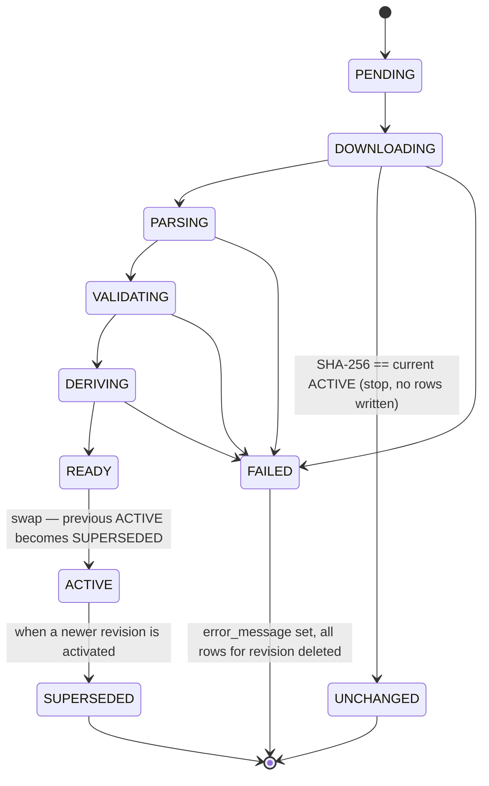

# GTFS Schedule Ingestion & Versioned Storage

This subsystem (`eu.transittrack.gtfs`) ingests GTFS Schedule ("static") feeds
from remote URLs, stores the full GTFS Schedule spec in PostgreSQL, and keeps
every import as an immutable **revision**. A Spring GraphQL read API serves the
active revision of each feed.

Design reference:
[`docs/superpowers/specs/2026-08-30-gtfs-ingestion-versioned-storage-design.md`](superpowers/specs/2026-08-30-gtfs-ingestion-versioned-storage-design.md).

Out of scope: GTFS-Realtime, trip planning / routing.

---

## 1. Defining a feed

A feed is a `{ code, name, description?, url, pollingCron?, enabled?, autoActivate? }`
record. `url` is the only transport detail — everything else is metadata or
policy. There are two ways to create one, and both ingest identically.

### 1a. Configuration (`transittrack.feed.feeds`)

Feed definitions live in a single place — `transittrack.feed.feeds[]` — shared with
AVL (an optional nested `avl` block, see [avl.md](avl.md)). Declared feeds are
reconciled into the `gtfs_feed` table at startup by `GtfsFeedConfigSynchronizer`
(an `ApplicationRunner` that runs after Liquibase), with `source = CONFIG`:

| Situation | Effect |
| --- | --- |
| `code` not in DB | insert |
| existing `CONFIG` feed | update `name`, `description`, `url`, `pollingCron`, `enabled`, `autoActivate` |
| existing `API` feed, same `code` | **startup fails** — ambiguous ownership |
| `CONFIG` feed in DB, absent from config | left untouched by default; deleted only when `transittrack.feed.prune-config-feeds: true` |

```yaml
transittrack:
  feed:
    feeds:
      - code: wroclaw
        name: "Wrocław"
        description: "MPK Wrocław"          # optional
        url: "https://przystanek.wroclaw.pl/feed/gtfs.zip"
        polling-cron: "0 30 3 * * *"        # optional; per-feed schedule
        enabled: true                       # optional, default true
        auto-activate: true                 # optional; overrides gtfs.ingest.auto-activate
```

The list may be empty — feeds can then be created purely via the mutation below.

### 1b. GraphQL mutation (`registerFeed`)

Creates a feed with `source = API`:

```graphql
mutation {
  registerFeed(input: {
    code: "wroclaw"
    name: "Wrocław"
    url: "https://przystanek.wroclaw.pl/feed/gtfs.zip"
    pollingCron: "0 30 3 * * *"
    enabled: true
    autoActivate: true
  }) { code source enabled }
}
```

Feed CRUD:

| Mutation | Notes |
| --- | --- |
| `registerFeed(input: RegisterFeedInput!): Feed!` | `code`, `name`, `url` required; `description`, `pollingCron`, `enabled`, `autoActivate` optional |
| `updateFeed(code: String!, input: UpdateFeedInput!): Feed!` | `name` and `url` required in the input |
| `deleteFeed(code: String!): Boolean!` | deletes the feed and its revisions |

---

## 2. Revision lifecycle

Every ingest opens a new `gtfs_revision` row. Revisions are full snapshots — every
GTFS entity row carries the `revision_id` it was loaded under; there is no
in-place mutation of a live revision.

### State machine (spec §5)



`DERIVING` is skipped when `transittrack.schedule.enabled = false`.

Terminal: `ACTIVE`, `SUPERSEDED`, `FAILED`, `UNCHANGED`.
Non-terminal: `PENDING`, `DOWNLOADING`, `PARSING`, `VALIDATING`, `DERIVING`, `READY`
(`READY` is only a resting state when `auto-activate = false`).

### Pipeline steps

1. **Download** — `FeedDownloader` streams the URL to a temp file, capped at
   `transittrack.http.max-size-bytes`, computing SHA-256 and byte size.
2. **Unchanged check** — if the SHA-256 equals the feed's current `ACTIVE`
   revision's `content_sha256`, the revision is set to `UNCHANGED` and the
   pipeline stops (no rows written).
3. **Unzip & required-file check** — extract the archive to a temp dir. Fails if
   any of `agency.txt`, `stops.txt`, `routes.txt`, `trips.txt`, `stop_times.txt`,
   and (`calendar.txt` or `calendar_dates.txt`) is missing. (`files_present` is
   persisted later, on the `VALIDATING` transition.)
4. **Parse & write** — `GtfsFileRegistry` is iterated in dependency order; each
   present, registered file is streamed by `GtfsCsvReader`, mapped to typed
   entities, and batched (`ingest.batch-size`, default 1000) through
   `RevisionWriter`. `locations.geojson` is read by `GtfsGeoJsonReader`;
   `shapes.txt` also accumulates per-`shape_id` aggregate rows. Files in the
   archive that are not part of the GTFS Schedule spec are ignored (they still
   appear in `filesPresent`). `row_counts` is populated, keyed by physical table
   name (`gtfs_agency`, `gtfs_stop`, …).
5. **Validate** — revision-scoped referential checks (orphan `route_id`,
   `service_id`, `trip_id`, `stop_id`, `shape_id`, `agency_id`,
   `parent_station`, fare/area/network/pathway refs, …). Counts and samples go
   to `validation_report`.
   - `strict-validation = true` → any error → `FAILED`.
   - `strict-validation = false` (default) → errors recorded as a report,
     ingest proceeds.
6. **Derive dates** — `feed_start_date` / `feed_end_date` from `feed_info.txt`
   if present, else min/max over `calendar` and `calendar_dates`.
7. **Derive schedule model** — when `transittrack.schedule.enabled`, the revision
   transitions to `DERIVING` and the six `@Order`ed `IngestionPostProcessor` beans
   in `eu.transittrack.schedule.derive` (`TripPatternProcessor` 10 →
   `DerivationFinalizeProcessor` 60) build `trip_pattern` / `stop_path` /
   `schedule_time` / `travel_times_for_stop_path` / `block` / `block_trip`, back-fill
   the derived columns on `trips` (`trip_pattern_id`, `start_time_sec`, …), and
   merge their counts into `row_counts`. Any failure funnels to `FAILED` like
   every other step. See [docs/schedule.md](schedule.md).
8. **Ready → Activate** — status becomes `READY`. If the effective
   `auto-activate` (feed override, else `ingest.auto-activate`, default `true`)
   is set, one transaction flips the current `ACTIVE` → `SUPERSEDED` and this
   revision → `ACTIVE`. Otherwise it waits for `activateRevision`.
9. **Prune** — see §4.

Any exception funnels to `FAILED`: `error_message` is set, every row for that
`revision_id` is deleted, and the `ACTIVE` pointer is left untouched. Temp
files are always cleaned up.

### Triggering an ingest

| Trigger | Behaviour |
| --- | --- |
| `ingestFeed(feedCode)` mutation | returns a `PENDING` revision immediately; pipeline runs async on a bounded executor |
| polling scheduler | see §5 |
| `IngestionService.ingestBlocking(feedCode)` | synchronous; returns the finished revision (used by tests / programmatic callers) |

**Guard:** an ingest is refused if the feed already has a revision in an
in-progress state (`PENDING`, `DOWNLOADING`, `PARSING`, `VALIDATING`, `DERIVING`). A revision
resting at `READY` (auto-activate off) does **not** block a new ingest. At most
one running ingest per feed; different feeds ingest in parallel up to the pool
size.

### Revision mutations

| Mutation | Notes |
| --- | --- |
| `ingestFeed(feedCode: String!): Revision!` | starts a new ingest, returns the `PENDING` revision |
| `activateRevision(revisionId: ID!): Revision!` | sets the given revision to `ACTIVE` and demotes the feed's current `ACTIVE` to `SUPERSEDED`. No status precondition is enforced — any revision id is accepted, so callers are responsible for passing a sensible one (normally a `READY` revision). |
| `deleteRevision(revisionId: ID!): Boolean!` | deletes the revision and its rows; **refuses the `ACTIVE` revision** |

---

## 3. `auto-activate` and `strict-validation`

Both are set under `transittrack.gtfs.ingest` and default the same way for every
feed; `auto-activate` can additionally be overridden per feed.

- **`auto-activate`** (default `true`) — when true, a successful ingest is
  promoted to `ACTIVE` automatically (step 7). When false, the ingest stops at
  `READY` and an operator must call `activateRevision` to make it live. Feed-level
  `autoActivate` (config key `auto-activate`, or the mutation input field) wins
  over the global value.
- **`strict-validation`** (default `false`) — when true, any referential
  validation error fails the revision. When false, validation still runs and its
  findings are stored in `validation_report` / exposed as `validationSummary`,
  but the ingest proceeds to activation.

---

## 4. Retention / pruning

After a revision activates, `RevisionService.prune` keeps the `ACTIVE` revision
plus the `transittrack.gtfs.retention.keep-revisions-per-feed` most-recent
terminal revisions (default 5). The rest — and all their rows — are deleted.
`UNCHANGED` and `FAILED` revisions count toward the limit and are pruned first.
The `ACTIVE` revision is never pruned.

```yaml
transittrack:
  gtfs:
    retention:
      keep-revisions-per-feed: 5
```

---

## 5. Polling scheduler

A single sweep (`GtfsIngestScheduler`) runs on
`transittrack.gtfs.polling.sweep-cron` and is only registered when
`transittrack.gtfs.polling.enabled = true`. For each enabled feed that has a
`pollingCron`, it computes whether the feed's cron has fired since the feed's
last ingest attempt and, if so, calls `IngestionService.ingest`. The per-feed
in-progress guard prevents overlap; feeds without a `pollingCron` are never
polled.

```yaml
transittrack:
  gtfs:
    polling:
      enabled: true
      sweep-cron: "0 * * * * *"   # how often the sweep wakes up (6-field Spring cron)
  feed:
    feeds:
      - code: wroclaw
        name: "Wrocław"
        url: "https://przystanek.wroclaw.pl/feed/gtfs.zip"
        polling-cron: "0 30 3 * * *"   # this feed is due at 03:30 daily
```

---

## 6. Read API

Types and query fields use bare names — `Route`, `Trip`, `Stop`, `routes`,
`trip`, `stopTimes`, … Every entity query resolves against a revision —
optional `revisionId` argument, defaulting to the feed's `ACTIVE` revision (an
error is raised if the feed has none).

### Feed / revision queries

```
feeds: [Feed!]!
feed(code: String!): Feed
revisions(feedCode: String!, status: RevisionStatus): [Revision!]!
revision(id: ID!): Revision
```

### Typed entity queries

```
agencies / routes / route / stops / stop /
trips / trip / stopTimes / calendars / calendarDates /
shape / frequencies / transfers / feedInfo / pathways / levels
```

Nested resolvers: `Route.agency`, `Route.trips`, `Trip.route`,
`Trip.stopTimes`, `Trip.shape`, `StopTime.stop`, `Stop.childStops`,
`Stop.level` — all scoped to the parent's `revision_id`. `Trip` also carries the
derived schedule fields and resolvers (`startTimeSec`, `pattern`, `block`, …);
see [docs/schedule.md](schedule.md).

### Worked example

```graphql
{
  feed(code: "wroclaw") {
    source
    activeRevision {
      status
      rowCounts
      validationSummary { errorCount warningCount }
    }
  }
  stopTimes(feedCode: "wroclaw", tripId: "T1") {
    stopSequence
    arrivalTime
    stop { stopName }
  }
}
```

```json
{
  "feed": {
    "source": "CONFIG",
    "activeRevision": {
      "status": "ACTIVE",
      "rowCounts": { "gtfs_agency": 1, "gtfs_stop": 3, "gtfs_route": 1, "gtfs_trip": 1, "gtfs_stop_time": 2 },
      "validationSummary": { "errorCount": 0, "warningCount": 0 }
    }
  },
  "stopTimes": [
    { "stopSequence": 1, "arrivalTime": "08:00:00", "stop": { "stopName": "First" } },
    { "stopSequence": 2, "arrivalTime": "08:10:00", "stop": { "stopName": "Second" } }
  ]
}
```

### `records` — long-tail escape hatch

The Fares v2 graph, areas/networks, translations, attributions, location groups
and `locations.geojson` are stored and validated but not yet exposed as typed
GraphQL. They are readable as raw JSON rows via:

```
records(feedCode: String!, table: Table!, revisionId: ID): [JSON!]!
```

`Table` enum values (GTFS *file* names, plural):

```
FARE_ATTRIBUTES  FARE_RULES  TIMEFRAMES  RIDER_CATEGORIES  FARE_MEDIA  FARE_PRODUCTS
FARE_LEG_RULES  FARE_LEG_JOIN_RULES  FARE_TRANSFER_RULES  AREAS  STOP_AREAS  NETWORKS
ROUTE_NETWORKS  LOCATION_GROUPS  LOCATION_GROUP_STOPS  LOCATIONS  BOOKING_RULES
TRANSLATIONS  ATTRIBUTIONS
```

```graphql
{ records(feedCode: "wroclaw", table: FARE_PRODUCTS) }
```

Typed GraphQL for these entities is a documented follow-up.

---

## 7. Configuration reference

```yaml
transittrack:
  http:                             # shared outbound HTTP client (GTFS download + AVL polling)
    connect-timeout-ms: 10000
    read-timeout-ms: 60000
    max-size-bytes: 524288000       # 500 MiB
    user-agent: "transittrack/0.0.1"
  gtfs:
    ingest:
      auto-activate: true
      strict-validation: false
      batch-size: 1000
      temp-dir: ""                   # "" -> java.io.tmpdir
    retention:
      keep-revisions-per-feed: 5
    polling:
      enabled: false
      sweep-cron: "0 0 * * * *"      # hourly
  feed:
    prune-config-feeds: false        # delete CONFIG feeds no longer in config
    feeds: []                        # see §1a
  schedule:
    enabled: true                    # run the DERIVING step (schedule model)
    layover-threshold-sec: 60
    stop-projection-max-deviation-m: 100
```
